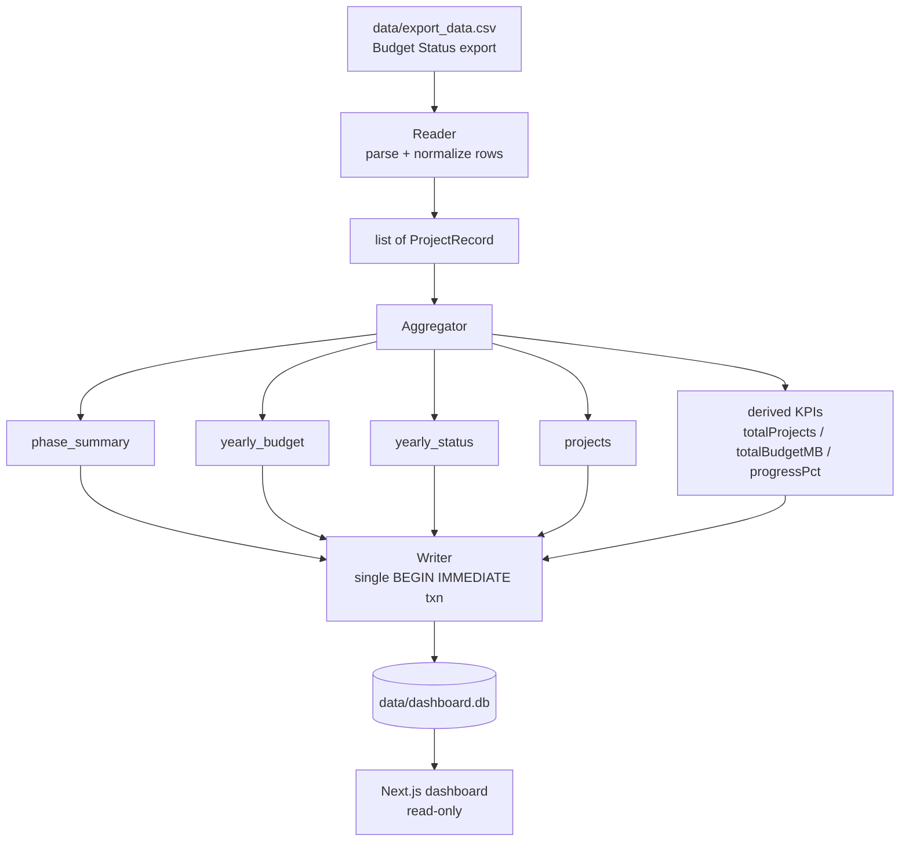
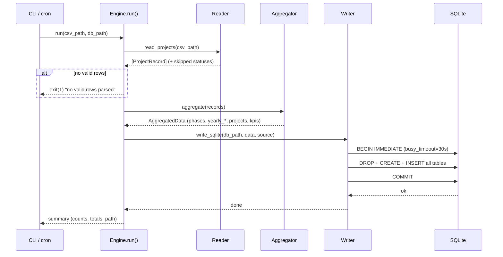

# Design Document: CSV-to-DB Engine

## Overview

The CSV-to-DB engine converts the "Budget Status" export at `data/export_data.csv` into
the aggregated SQLite database at `data/dashboard.db` that the Next.js PM dashboard reads.
It supersedes the existing `etl/import_csv.py` script by extracting its parsing, mapping,
aggregation, and write logic into a small, testable Python module with a clear pipeline:
**read → normalize → aggregate → write**.

The engine preserves the established SQLite schema (shared with `etl/etl.py` and
`etl/seed.py`) so the dashboard needs no changes, and it keeps the in-place,
single-transaction write strategy that is safe while the dashboard holds the DB file open
read-only on Windows. It also reconciles a subtle inconsistency between the existing
scripts in how `yearly_budget.commit_actual_mb` is computed (see Design Decisions).

The engine is a batch, offline component. It runs on demand (`py etl/import_csv.py`) or on
a schedule (cron / Task Scheduler), reads one CSV, and rewrites the whole database. There is
no incremental update path — each run is a full, deterministic rebuild from the source CSV.

## Architecture



The engine has three internal stages, each independently testable:

1. **Reader** — opens the CSV (`utf-8-sig`), parses each row, normalizes status strings and
   money cells, maps status → phase key, drops rows with an unmapped status or unparseable
   year, and produces a list of clean `ProjectRecord` values.
2. **Aggregator** — a pure function from `list[ProjectRecord]` to the four table datasets
   plus derived KPIs. No I/O, fully deterministic.
3. **Writer** — persists all datasets to SQLite in a single `BEGIN IMMEDIATE` transaction
   with a busy timeout, rewriting tables in place.

## Sequence Diagram



## Components and Interfaces

### Component 1: Reader

**Purpose**: Turn raw CSV rows into validated, normalized `ProjectRecord` values.

**Responsibilities**:
- Open CSV with `utf-8-sig` (strip BOM); parse with `csv.DictReader`.
- Normalize `Status Budget` (lowercase, collapse whitespace) and map to a `PhaseKey`.
- Parse money cells that may be blank, `-`, quoted, or comma-grouped.
- Parse `Budget year` to an `int`; skip rows where it is missing/invalid.
- Skip rows with an unmapped status and report the distinct skipped statuses.
- Derive `committedMB = max(usage - actual, 0)` and carry `usageMB` for yearly rollups.

**Interface** (Python):
```python
def read_projects(csv_path: Path) -> tuple[list[ProjectRecord], list[str]]:
    """Return (records, skipped_statuses). skipped_statuses is the raw status
    strings that did not map to a phase (for logging)."""
```

### Component 2: Aggregator

**Purpose**: Compute all four table datasets and derived KPIs from the record list.

**Responsibilities**:
- `phase_summary`: count, budget_mb, actual_mb per phase (all five phases always present).
- `yearly_budget`: per year, budget_mb and commit_actual_mb (== usage; see Design Decision).
- `yearly_status`: per year, count per phase.
- `projects`: pass-through row-level detail.
- KPIs: `totalProjects`, `totalBudgetMB`, `progressPct`.

**Interface** (Python):
```python
def aggregate(records: list[ProjectRecord]) -> AggregatedData: ...
```

### Component 3: Writer

**Purpose**: Persist `AggregatedData` to SQLite safely and atomically.

**Responsibilities**:
- Ensure the parent directory exists.
- Open with `isolation_level=None` (autocommit) and `timeout=30` (busy timeout).
- Run one `BEGIN IMMEDIATE` transaction: DROP + CREATE + INSERT every table, plus
  `metadata` (`last_run` ISO timestamp, `source`); `COMMIT`; `ROLLBACK` on any error.
- Rewrite in place (no temp-file rename) so a dashboard holding a read-only handle on
  Windows is not broken.

**Interface** (Python):
```python
def write_sqlite(db_path: Path, data: AggregatedData, source_name: str) -> None: ...
```

### Component 4: Engine / CLI entry point

**Purpose**: Orchestrate read → aggregate → write and provide a command-line interface.

**Interface** (Python):
```python
def run(csv_path: Path, db_path: Path) -> RunSummary: ...
def main(argv: list[str]) -> int:  # returns process exit code
    ...
```

## Data Models

### PhaseKey and phase metadata (must match `lib/dashboard-types.ts`)

```python
PhaseKey = Literal[
    "BUDGET_CLOSED", "INSTALL_COMPLETED", "PO_CREATED", "PO_ON_PROCESS", "PR_ON_PROCESS"
]

PHASES = [
    {"key": "BUDGET_CLOSED",     "label": "Budget Closed",          "color": "#2563eb"},
    {"key": "INSTALL_COMPLETED", "label": "Installation Completed", "color": "#0d9488"},
    {"key": "PO_CREATED",        "label": "PO Created",             "color": "#b45309"},
    {"key": "PO_ON_PROCESS",     "label": "PO On Process",          "color": "#be123c"},
    {"key": "PR_ON_PROCESS",     "label": "PR On Process",          "color": "#6d28d9"},
]

STATUS_TO_PHASE = {
    "budget closed":          "BUDGET_CLOSED",
    "installation completed": "INSTALL_COMPLETED",
    "po created":             "PO_CREATED",
    "po on process":          "PO_ON_PROCESS",
    "pr on process":          "PR_ON_PROCESS",
}
```

### ProjectRecord (internal, one per valid CSV row)

```python
@dataclass(frozen=True)
class ProjectRecord:
    name: str
    pm: str
    phase: PhaseKey
    year: int
    budget_mb: float      # Amt Budget / 1_000_000, rounded 2dp
    actual_mb: float      # Amt Actual / 1_000_000, rounded 2dp
    committed_mb: float   # max(usage - actual, 0) / 1_000_000, rounded 2dp
    usage_mb: float       # Budget Usgae / 1_000_000, rounded 2dp
```

**Validation rules**:
- `phase` is one of the five `PhaseKey` values (row dropped otherwise).
- `year` is a valid integer parsed from `Budget year` (row dropped otherwise).
- Money fields default to `0.0` for blank / `-` / unparseable cells.
- `committed_mb` is never negative.

### AggregatedData (output of the Aggregator)

```python
@dataclass(frozen=True)
class AggregatedData:
    phases: list[dict]          # phase_summary rows
    yearly_budget: list[dict]   # sorted by year
    yearly_status: list[dict]   # sorted by year
    projects: list[dict]        # row-level
    total_projects: int
    total_budget_mb: float
    progress_pct: float
```

### Target SQLite schema (unchanged — the dashboard's contract)

```sql
CREATE TABLE phase_summary (
    phase_key TEXT PRIMARY KEY, label TEXT, color TEXT,
    count INTEGER, budget_mb REAL, actual_mb REAL
);
CREATE TABLE yearly_budget (
    year INTEGER PRIMARY KEY, budget_mb REAL, commit_actual_mb REAL
);
CREATE TABLE yearly_status (
    year INTEGER PRIMARY KEY, budget_closed INTEGER, install_completed INTEGER,
    po_created INTEGER, po_on_process INTEGER, pr_on_process INTEGER
);
CREATE TABLE projects (
    name TEXT, project_manager TEXT, phase_key TEXT, year INTEGER,
    budget_mb REAL, actual_mb REAL, committed_mb REAL
);
CREATE TABLE metadata (key TEXT PRIMARY KEY, value TEXT);
```

## Algorithmic Pseudocode

### Algorithm: Parse a money cell

```pascal
ALGORITHM parseMoney(x)
INPUT: x — a raw CSV cell (string or null)
OUTPUT: value — float in raw currency units

BEGIN
    IF x = NULL THEN RETURN 0.0 END IF
    s ← trim(replaceAll(toString(x), ",", ""))   // strip thousands separators
    IF s = "" OR s = "-" THEN RETURN 0.0 END IF
    TRY
        RETURN toFloat(s)
    CATCH parseError
        RETURN 0.0
    END TRY
END
```

**Preconditions:** `x` may be any value including null.
**Postconditions:** returns a finite non-negative-or-signed float; never raises.

### Algorithm: Read and normalize projects

```pascal
ALGORITHM readProjects(csvPath)
INPUT: csvPath — path to the export CSV
OUTPUT: (records, skipped) — valid ProjectRecords + distinct unmapped statuses

BEGIN
    records ← empty list
    skipped ← empty list
    OPEN csvPath WITH encoding "utf-8-sig" AS file
    rows ← parseCsvWithHeader(file)

    FOR each row IN rows DO
        ASSERT invariant: every record already in `records` has a valid phase and year

        rawStatus ← row["Status Budget"]
        key ← STATUS_TO_PHASE[ normalizeStatus(rawStatus) ]   // lowercase + collapse spaces
        IF key = NULL THEN
            IF trim(rawStatus) ≠ "" THEN skipped.append(trim(rawStatus)) END IF
            CONTINUE
        END IF

        TRY
            year ← toInt(toFloat(trim(row["Budget year"])))
        CATCH
            CONTINUE   // drop rows with no usable year
        END TRY

        budget ← parseMoney(row["Amt Budget"])
        actual ← parseMoney(row["Amt Actual"])
        usage  ← parseMoney(row["Budget Usgae"])       // = actual + commitment
        committed ← MAX(usage - actual, 0.0)

        record ← ProjectRecord(
            name       = trim(row["Project"]),
            pm         = trim(row["Project Manager"]),
            phase      = key,
            year       = year,
            budget_mb  = round(budget / MB_DIV, 2),
            actual_mb  = round(actual / MB_DIV, 2),
            committed_mb = round(committed / MB_DIV, 2),
            usage_mb   = round(usage / MB_DIV, 2)
        )
        records.append(record)
    END FOR

    RETURN (records, distinct(skipped))
END
```

**Preconditions:** `csvPath` exists and has the documented header row.
**Postconditions:** every returned record has a valid `PhaseKey` and integer `year`;
skipped contains only statuses that were non-empty and unmapped.
**Loop invariant:** every record accumulated so far satisfies the record validation rules.

### Algorithm: Aggregate

```pascal
ALGORITHM aggregate(records)
INPUT: records — list of ProjectRecord
OUTPUT: AggregatedData

BEGIN
    // --- phase_summary: initialize ALL phases to zero so none are missing ---
    phaseAcc ← map every PHASE.key → {count: 0, budget: 0.0, actual: 0.0}
    FOR each r IN records DO
        a ← phaseAcc[r.phase]
        a.count  ← a.count + 1
        a.budget ← a.budget + r.budget_mb
        a.actual ← a.actual + r.actual_mb
    END FOR
    phases ← for each PHASE p, emit {p.key, p.label, p.color,
                 count: phaseAcc[p.key].count,
                 budget_mb: round(phaseAcc[p.key].budget, 2),
                 actual_mb: round(phaseAcc[p.key].actual, 2)}

    // --- yearly_budget: budget vs usage (== commit + actual) ---
    yb ← empty map year → {budget: 0.0, usage: 0.0}
    FOR each r IN records DO
        v ← yb.setdefault(r.year, {budget: 0.0, usage: 0.0})
        v.budget ← v.budget + r.budget_mb
        v.usage  ← v.usage  + r.usage_mb
    END FOR
    yearlyBudget ← for each (year, v) in sortByKey(yb):
                     {year, budget_mb: round(v.budget,2), commit_actual_mb: round(v.usage,2)}

    // --- yearly_status: count per phase per year ---
    ys ← empty map year → {year, all five phase keys → 0}
    FOR each r IN records DO
        row ← ys.setdefault(r.year, zeroPhaseRow(r.year))
        row[r.phase] ← row[r.phase] + 1
    END FOR
    yearlyStatus ← sortByYear(values(ys))

    // --- projects: row-level pass-through ---
    projects ← for each r IN records: {r.name, r.pm, r.phase, r.year,
                                        r.budget_mb, r.actual_mb, r.committed_mb}

    // --- derived KPIs ---
    totalProjects ← SUM over phases of count
    totalBudgetMB ← SUM over phases of budget_mb
    progressed    ← SUM of counts for phases in {BUDGET_CLOSED, INSTALL_COMPLETED, PO_CREATED}
    progressPct   ← IF totalProjects > 0 THEN round(progressed / totalProjects * 100, 1) ELSE 0

    RETURN AggregatedData(phases, yearlyBudget, yearlyStatus, projects,
                          totalProjects, totalBudgetMB, progressPct)
END
```

**Preconditions:** every record has a valid phase and year.
**Postconditions:**
- `phases` contains exactly five rows (one per `PHASE`), in canonical order.
- `sum(phase.count) == len(records)`.
- `yearly_status` and `yearly_budget` are sorted ascending by year and cover exactly the
  set of years present in `records`.
- `0 ≤ progressPct ≤ 100`.
**Loop invariants:** each accumulator holds the partial sum/count over all records visited
so far; unvisited records do not affect it.

### Algorithm: Write SQLite (safe in-place rewrite)

```pascal
ALGORITHM writeSqlite(dbPath, data, sourceName)
INPUT: dbPath, AggregatedData, sourceName
OUTPUT: none (side effect: dbPath rewritten)

BEGIN
    ensureParentDir(dbPath)
    db ← sqliteConnect(dbPath, isolationLevel = NONE, timeout = 30)   // autocommit + busy wait
    TRY
        db.execute("BEGIN IMMEDIATE")            // acquire write lock up front
        FOR each t IN [phase_summary, yearly_budget, yearly_status, projects, metadata] DO
            db.execute("DROP TABLE IF EXISTS " + t)
        END FOR
        createAllTables(db)
        insertPhaseSummary(db, data.phases)
        insertYearlyBudget(db, data.yearly_budget)
        insertYearlyStatus(db, data.yearly_status)
        insertProjects(db, data.projects)
        db.execute("INSERT INTO metadata VALUES ('last_run', ?)", nowIso())
        db.execute("INSERT INTO metadata VALUES ('source', ?)", "import_csv (" + sourceName + ")")
        db.execute("COMMIT")
    CATCH error
        TRY db.execute("ROLLBACK") CATCH sqliteError DO nothing END TRY
        RAISE error
    FINALLY
        db.close()
    END TRY
END
```

**Preconditions:** `data` is well-formed `AggregatedData`.
**Postconditions:** on success, all five tables reflect `data` and are committed atomically;
on failure, the transaction is rolled back and the previous DB content is preserved (no
partial write is visible to readers).

## Key Functions with Formal Specifications

### `parse_money(x: str | None) -> float`
- **Pre:** none. **Post:** returns a float; blank/`-`/invalid → `0.0`; never raises.

### `phase_of(status: str) -> PhaseKey | None`
- **Pre:** `status` is a string. **Post:** returns a valid `PhaseKey` iff the
  space-normalized, lowercased status is a known key; otherwise `None`.

### `read_projects(csv_path) -> tuple[list[ProjectRecord], list[str]]`
- **Pre:** `csv_path` exists with the documented header.
- **Post:** every record has a valid phase and integer year; `committed_mb ≥ 0`;
  second element lists distinct unmapped non-empty statuses.

### `aggregate(records) -> AggregatedData`
- **Pre:** records satisfy validation. **Post:** see Aggregate postconditions above.

### `write_sqlite(db_path, data, source_name) -> None`
- **Pre:** writable path. **Post:** atomic full rewrite or full rollback.

### `run(csv_path, db_path) -> RunSummary`
- **Pre:** paths provided. **Post:** if no valid rows, raises/returns error exit; otherwise
  DB rewritten and a summary (counts, totals, output path) returned.

## Example Usage

```python
from pathlib import Path
from etl.import_csv import run

# Programmatic use
summary = run(
    csv_path=Path("data/export_data.csv"),
    db_path=Path("data/dashboard.db"),
)
print(summary.total_projects, summary.total_budget_mb)

# CLI use (unchanged from today's script)
#   py etl/import_csv.py                      # reads data/export_data.csv
#   py etl/import_csv.py path/to/export.csv   # explicit path
```

```python
# Reader in isolation (unit-testable)
records, skipped = read_projects(Path("data/export_data.csv"))
assert all(r.committed_mb >= 0 for r in records)
if skipped:
    print("Unmapped statuses:", sorted(set(skipped)))

# Aggregator is pure — no DB needed
data = aggregate(records)
assert len(data.phases) == 5
assert sum(p["count"] for p in data.phases) == len(records)
```

## Correctness Properties

### Property 1: Count conservation

`sum(phase.count for phase in phases) == len(records)`
and equals `len(projects)`. ∀ valid CSV inputs.

**Validates: Requirements 4.3**

### Property 2: All phases present

`phases` always has exactly the five canonical phase
keys, in order, even when some have zero rows.

**Validates: Requirements 4.1, 6.2**

### Property 3: Committed non-negativity

∀ records,
`committed_mb == max(usage_mb - actual_mb, 0) ≥ 0`.

**Validates: Requirements 1.4, 7.2**

### Property 4: Year coverage

the set of years in `yearly_budget` == set in `yearly_status`
== set of `record.year` values; both are sorted ascending.

**Validates: Requirements 5.3, 6.3, 6.4**

### Property 5: Progress bounds

`0 ≤ progressPct ≤ 100`, and `progressPct == 0` when there
are no records.

**Validates: Requirements 8.3, 8.4, 8.5**

### Property 6: Yearly budget definition

for each year, `commit_actual_mb == Σ usage_mb`
over that year's records (i.e. actual + commitment), matching the dashboard's stacked chart.

**Validates: Requirements 5.2**

### Property 7: Atomicity

a reader observes either the complete previous DB or the complete
new DB — never a partially written state (guaranteed by the single `BEGIN IMMEDIATE`
transaction).

**Validates: Requirements 9.1, 9.3, 10.2**

### Property 8: Idempotence

running the engine twice on the same CSV yields identical table
contents (modulo the `metadata.last_run` timestamp).

**Validates: Requirements 9.6**

## Error Handling

### CSV file not found
- **Condition:** `csv_path` does not exist.
- **Response:** print a clear message pointing at the default location; exit code `1`.
- **Recovery:** user supplies the correct path.

### No valid rows parsed
- **Condition:** every row is dropped (unmapped status / bad year / empty file).
- **Response:** print guidance to check headers and status values; exit code `1`; the DB is
  **not** touched.
- **Recovery:** fix the export headers or status mapping.

### Unmapped statuses (partial)
- **Condition:** some rows have statuses not in `STATUS_TO_PHASE`.
- **Response:** skip those rows, continue, and print the count + distinct skipped statuses.
- **Recovery:** extend `STATUS_TO_PHASE` if a new status should be recognized.

### SQLite locked / write failure
- **Condition:** another writer holds the lock beyond the busy timeout, or a write fails
  mid-transaction.
- **Response:** the 30s busy timeout waits out transient reader locks; a mid-transaction
  failure triggers `ROLLBACK` and re-raises, leaving the prior DB intact.
- **Recovery:** re-run the engine; readers are unaffected by the failed run.

## Testing Strategy

### Unit testing approach
- `parse_money`: blank, `-`, `"1,234.5"`, quoted, non-numeric, `None` → expected floats.
- `phase_of`: exact, mixed-case, extra-spaced, and unknown statuses.
- `read_projects`: fixture CSVs covering unmapped status, missing year, BOM header, and
  comma-grouped money; assert dropped rows and `committed_mb ≥ 0`.
- `write_sqlite`: write to a temp DB, then read back each table and assert schema + contents;
  assert `metadata.last_run` and `metadata.source` exist.

### Property-based testing approach
Encode the Correctness Properties as generative tests: generate random lists of
`ProjectRecord` and assert count conservation, all-phases-present, committed non-negativity,
year coverage, progress bounds, and idempotence.

**Property test library:** `hypothesis` (Python).

### Integration testing approach
Run `run()` end-to-end on `data/export_data.csv` into a temp DB, then invoke the same
SELECTs the dashboard uses (mirroring `lib/dashboard-data.ts`) and assert the derived
`totalProjects`, `totalBudgetMB`, and `progressPct` match the aggregator's KPIs.

## Performance Considerations

The dataset is small (dozens to low thousands of rows). A full in-memory parse + rebuild is
well under a second, so no streaming or indexing is required. The write holds the `IMMEDIATE`
lock for only milliseconds; readers wait it out via the 30s busy timeout.

## Security Considerations

- No secrets are involved in the CSV path (unlike `etl.py`, which reads DB credentials from
  `.env.local`). Continue loading any env via `python-dotenv` only if a future source needs it.
- All SQL uses parameterized `?` placeholders; table names are internal constants, never
  derived from input — no SQL injection surface from CSV content.
- Treat the CSV as untrusted input: never `eval`/format cell values into SQL; the parser
  coerces types and defaults on failure rather than trusting the source.

## Dependencies

- **Python standard library:** `csv`, `sqlite3`, `pathlib`, `datetime`, `dataclasses`,
  `typing`.
- **Dev/test only:** `hypothesis` (property-based tests), `pytest` (test runner).
- **No new runtime dependency** beyond the existing Python toolchain in `etl/requirements.txt`.

## Design Decisions

1. **Supersede, don't fork, `import_csv.py`.** The current script mixes parsing, aggregation,
   and writing in one file. The engine keeps the same CLI and output but factors the logic
   into `read_projects` / `aggregate` / `write_sqlite` so each stage is independently
   testable. `etl.py` (MS SQL source) and `seed.py` (sample data) can later reuse the shared
   `aggregate` + `write_sqlite` functions, but that refactor is out of scope here.

2. **`yearly_budget.commit_actual_mb` uses per-row `usage_mb`.** The existing scripts disagree:
   `seed.py`/`etl.py` sum `committed + actual`, while `import_csv.py` sums `usageMB` (raw
   Budget Usgae). Because `committed = max(usage - actual, 0)`, these differ only when
   `usage < actual`. The engine standardizes on **`Σ usage_mb`**, matching `import_csv.py`
   and the raw export semantics (Budget Usgae is the authoritative "actual + commitment"
   figure). This is called out so requirements can confirm the intended definition.

3. **In-place rewrite over temp-file-and-rename.** Preserved from the existing scripts because
   the dashboard holds the SQLite file open read-only and Windows cannot rename over an open
   file. A single short `BEGIN IMMEDIATE` transaction gives atomicity without a rename.

4. **Phase colors.** The engine writes the `import_csv.py` color set (`#2563eb`, …), which
   matches `PHASE_COLOR` in `lib/dashboard-types.ts`; note `PHASES` in that file lists a
   different display palette. Colors written here feed `phase_summary.color`; requirements
   should confirm which palette is authoritative.
```
